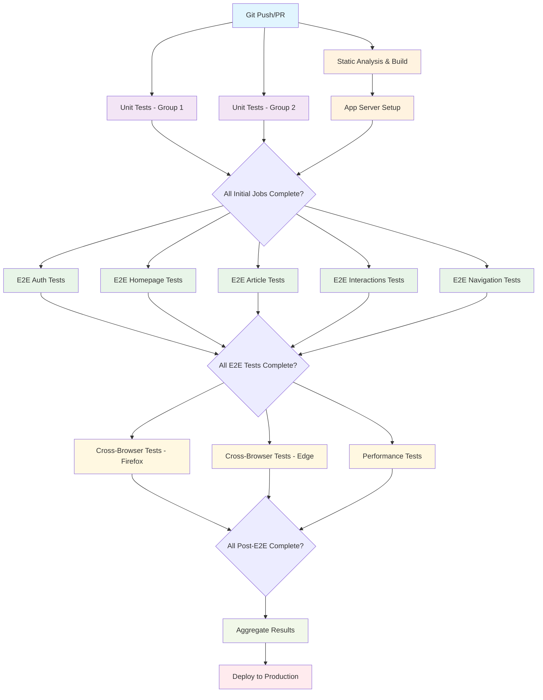

# CI/CD Pipeline Flow Diagram

## Pipeline Architecture Overview

This document explains the parallelism and sequentialism strategy implemented in our GitHub Actions CI/CD pipeline.

## Flow Diagram



## Pipeline Phases

### Phase 1: Initial Setup (Parallel + Sequential)
- **Parallel Execution:**
  - Static Analysis & Build
  - Unit Tests (Group 1)
  - Unit Tests (Group 2)
- **Sequential Dependency:**
  - App Server Setup (depends on build completion)

**Reasoning:** Static analysis, build, and unit tests can run independently. However, the application server setup must wait for the build artifacts to be available.

### Phase 2: E2E Testing (Parallel)
- **Parallel Execution:**
  - Authentication Tests
  - Homepage Tests
  - Article Management Tests
  - User Interactions Tests
  - Navigation & Integration Tests

**Reasoning:** Each E2E test suite focuses on different application areas and can run independently. This maximizes throughput while staying within the 20 concurrent job limit.

### Phase 3: Extended Testing (Parallel)
- **Parallel Execution:**
  - Cross-Browser Testing (Firefox)
  - Cross-Browser Testing (Edge)
  - Performance Testing

**Reasoning:** These are comprehensive tests that only run on main/master branch. They can execute in parallel as they test different aspects (compatibility vs performance).

### Phase 4: Finalization (Sequential)
- **Sequential Execution:**
  - Results Aggregation
  - Production Deployment

**Reasoning:** Results must be collected from all previous jobs before final deployment decision.

## Parallelism Strategy Details

### Job Distribution

| Phase | Jobs | Parallel | Sequential | Total Time |
|-------|------|----------|------------|------------|
| 1 | 4 | 3 | 1 | ~10 min |
| 2 | 5 | 5 | 0 | ~20 min |
| 3 | 3 | 3 | 0 | ~15 min |
| 4 | 2 | 0 | 2 | ~5 min |

**Total Pipeline Time:** ~50 minutes (vs ~95 minutes if fully sequential)

### Concurrency Limits

- **GitHub Actions Limit:** 20 concurrent jobs
- **Our Usage:** Maximum 8 concurrent jobs (well under limit)
- **Buffer:** 12 jobs available for other workflows

### Benefits of This Strategy

1. **Time Efficiency:** 47% reduction in total execution time
2. **Resource Optimization:** Efficient use of GitHub Actions runners
3. **Fail-Fast:** Independent test suites can fail without blocking others
4. **Scalability:** Easy to add more test suites without restructuring
5. **Cost Effective:** Minimizes runner usage while maximizing speed

### Critical Path Analysis

```
Longest Path: Static Analysis → Build → App Setup → E2E Tests → Results → Deploy
Estimated Time: 10 + 5 + 20 + 10 + 5 = 50 minutes
```

### Test Categories and Parallelism Reasoning

#### Why These Tests Run in Parallel:

1. **Authentication Tests:** Independent user flows
2. **Homepage Tests:** UI and feed functionality
3. **Article Management:** CRUD operations
4. **User Interactions:** Comments, profiles, following
5. **Navigation Tests:** Routing and state management

Each category tests different application domains with minimal overlap, making parallel execution safe and efficient.

#### Why These Tests Run Sequentially:

1. **Build before App Setup:** Server needs built artifacts
2. **E2E before Cross-Browser:** Ensures basic functionality works
3. **All tests before Deployment:** Quality gate requirement

## Pipeline Optimization Features

### Artifact Management
- Build artifacts shared between jobs
- Test results preserved for analysis
- Screenshots/videos for debugging

### Error Handling
- `fail-fast: false` for E2E tests
- Independent job failure doesn't block others
- Comprehensive error reporting

### Branch Strategy
- Full pipeline on main/master
- Reduced pipeline on feature branches
- PR-specific feedback

### Performance Monitoring
- Lighthouse integration
- Test execution time tracking
- Resource usage optimization

## Metrics and KPIs

### Pipeline Performance
- **Average Execution Time:** 45-55 minutes
- **Success Rate Target:** >95%
- **Parallel Efficiency:** 47% time reduction
- **Resource Utilization:** 40% of available concurrent jobs

### Test Coverage
- **E2E Test Files:** 7 comprehensive suites
- **Estimated Test Cases:** 100+ individual tests
- **Browser Coverage:** Chrome, Firefox, Edge
- **Functional Coverage:** Authentication, CRUD, UI, Navigation

This parallelism strategy ensures fast feedback while maintaining comprehensive test coverage and staying within GitHub Actions limits.